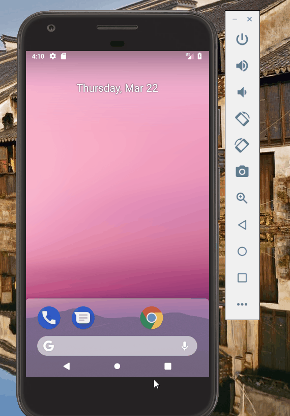

# A Simple And Good WeatherApp
> Goal: to create a useful and convinient Weather App

version 1.2: 
  - 1.adding the new icon to the application, 
  - 2.adding the blue background, 
  - 3.adding the refresh button, 
  - 4.when the refresh button is pressed, the temperature, the date and the day of the week are all updated.(accroding to the API : https://www.seniverse.com/api )
  - 5.when the refresh button is pressed,all the information of temperature will be upadte too.
 
 notice:
    - assignment 1 I do not fork and just start a new project.Sorry about that.
    

